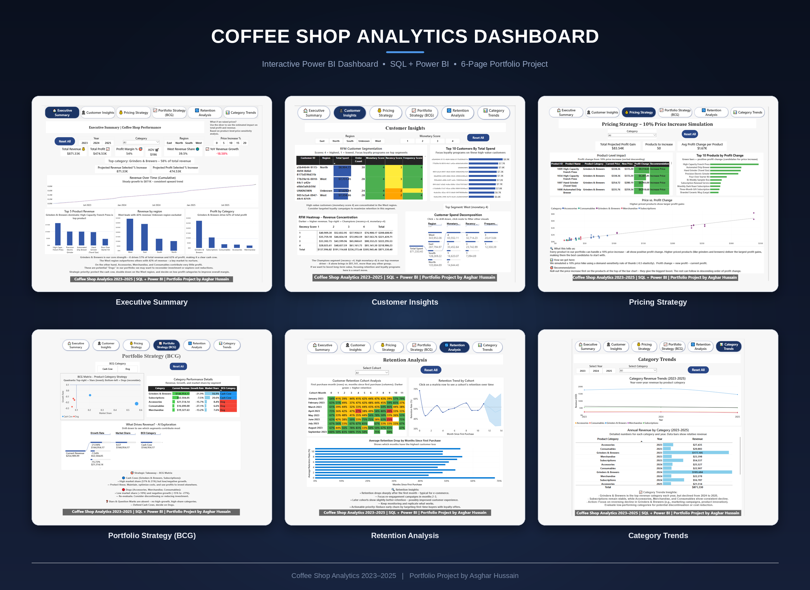
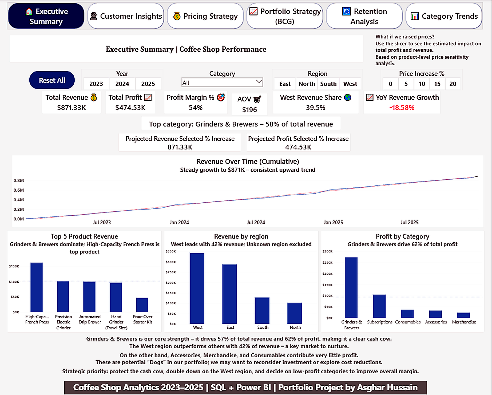
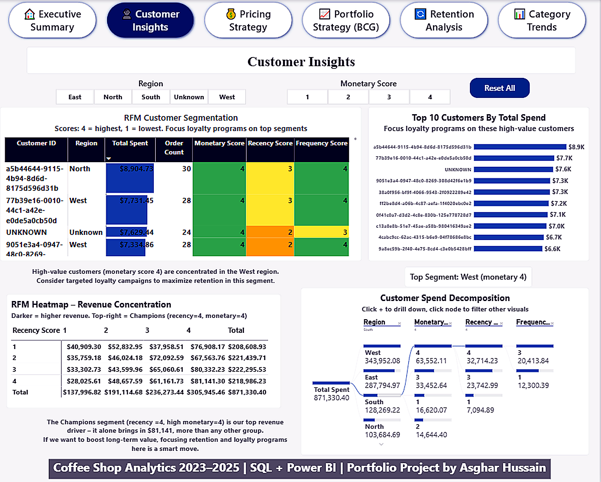
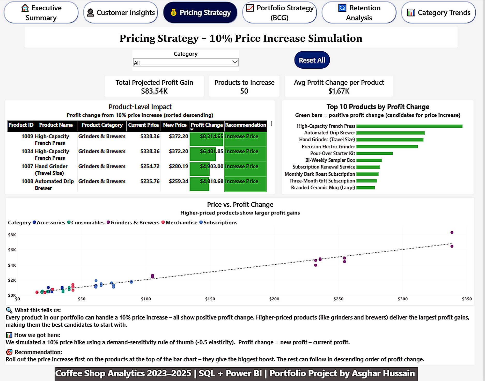
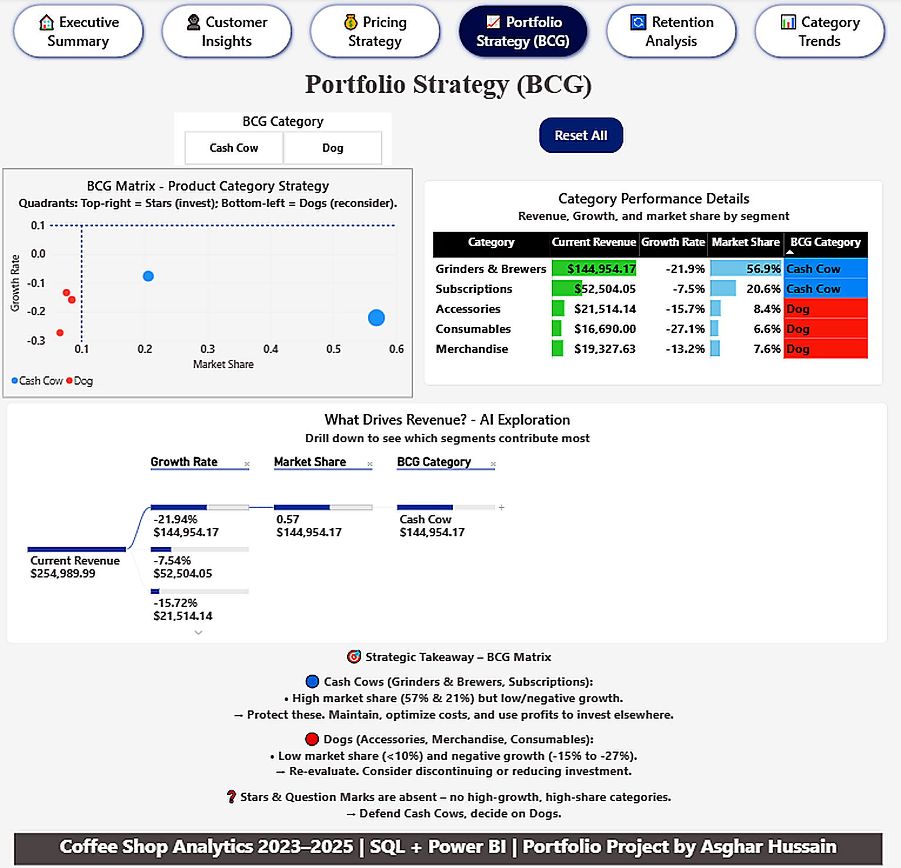
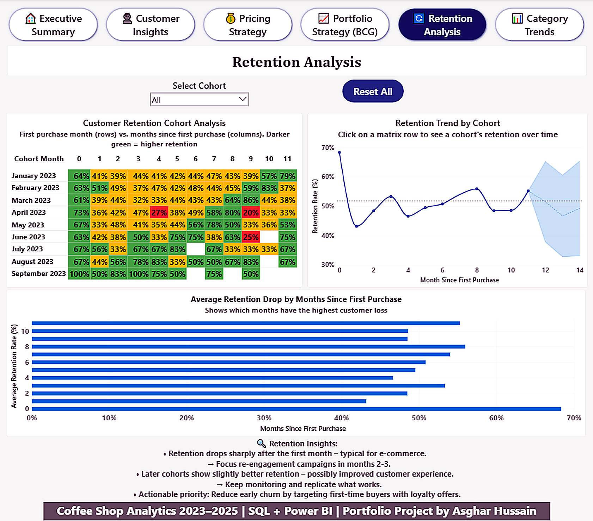
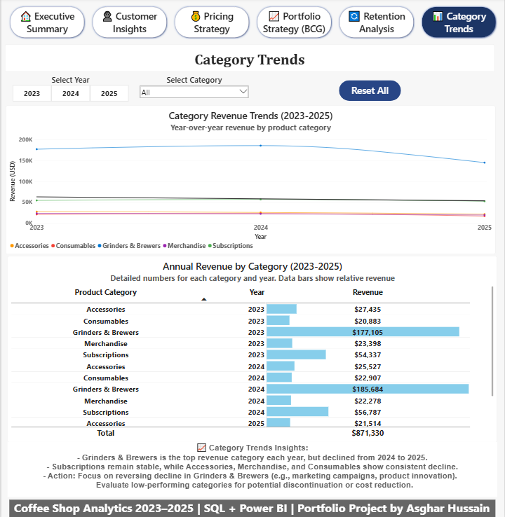

# ☕ Coffee Shop Analytics — From Raw Data to Business Strategy

**CSV Data → PostgreSQL → Power BI — A Complete Data Analytics Pipeline**




---

## 📖 The Story Behind This Project

Every coffee shop owner faces the same challenge: *"How do we increase revenue without losing customers?"*

For this project, I analyzed three years of transactional data (2023–2025) from a specialty coffee business. The dataset includes **~450 customers**, **50 products**, and **~2,000 orders** — a realistic, messy dataset that simulates real-world business problems.

I set out to answer three critical business questions:

- **Should we increase prices?** — And if so, on which products?
- **Who are our most valuable customers?** — And how do we keep them?
- **Which product categories are worth investing in?** — And which should we phase out?

This wasn't just about building charts — it was about giving a coffee shop owner a **data-driven strategy** to grow profitably.

---

## 🔥 Key Business Insights & Actions

Here's what the data actually told me, and what I would do about it:

| 💡 Insight | 📊 What the Data Says | 🚀 Business Action |
| :--- | :--- | :--- |
| **Pricing Power** | A 10% price increase shows **positive profit impact** across the entire portfolio. High‑priced products (Grinders & Brewers) deliver the largest gains. | Implement the hike in **phases** — start with Grinders & Brewers. Monitor customer reaction closely. |
| **Customer Concentration** | The **top 10 customers** contribute **$96K (~11% of total revenue)**. High‑value customers are concentrated in the **West region** (42% of revenue). | Launch a **loyalty program** for top spenders. Offer premium subscriptions and personalized offers. |
| **Cash Cow vs. Dogs** | Grinders & Brewers = **57% revenue, 62% profit** (Cash Cow). Accessories, Merchandise, Consumables = **Dogs** (low share, negative growth). | **Protect the Cash Cow**. **Re‑evaluate Dogs** — consider discontinuing or reducing investment. |
| **Retention Dip** | Retention drops from **100% → ~45% → ~33%** in months 1–3. Later cohorts show slightly better retention. | Focus **re‑engagement campaigns** on **months 2–3**. Target first‑time buyers with loyalty offers. |

---

## 📊 Dashboard Walkthrough — 6 Pages

### Page 1: Executive Summary
The 30,000‑foot view for busy stakeholders.

- **KPI Cards:** Total Revenue (**$871.33K**), Total Profit (**$474.53K**), Profit Margin (**54%**), AOV (**$196**), West Revenue Share (**42%**).
- **Revenue Over Time:** Cumulative revenue with forecast — steady growth to $871K.
- **Top 5 Products, Profit by Category, Revenue by Region.**



---

### Page 2: Customer Insights
Who are our best customers, and how do we keep them?

- **RFM Table:** Conditional formatting (Monetary, Recency, Frequency scores — 4 = best).
- **Top 10 Customers:** Highest spender: **$8,904.73** with 30 orders.
- **RFM Heatmap:** **Champions** (recency=4, monetary=4) generate **$81,141.30**.
- **Decomposition Tree:** AI‑driven customer exploration — West region dominates high‑value segment.



---

### Page 3: Pricing Strategy
Should we increase prices? A simulation.

- **KPI Cards:** Total Projected Profit Gain (**$83.54K**), Products to Increase (**50**), Avg Profit Change (**$1.67K**).
- **Top Impact:** High‑Capacity French Press adds **+$8,314.65** in profit.
- **Scatter Plot:** Higher‑priced products show larger profit gains.



---

### Page 4: Portfolio Strategy (BCG Matrix)
Where to invest, maintain, or divest.

- **Cash Cows:** Grinders & Brewers (56.8% market share), Subscriptions (20.6%).
- **Dogs:** Accessories, Merchandise, Consumables (<10% market share, negative growth).
- **AI Decomposition Tree:** Revenue driver exploration.



---

### Page 5: Retention Analysis
Do customers come back after their first purchase?

- **Cohort Retention Matrix:** Dark green = high retention.
- **Key Finding:** Retention drops sharply after month 1 — focus campaigns on months 2–3.



---

### Page 6: Category Trends
Year‑over‑year revenue by product category.

| Category | 2023 | 2024 | 2025 | Trend |
|----------|------|------|------|-------|
| **Grinders & Brewers** | $177,105 | $185,684 | $144,954 | 📉 -21.9% |
| **Subscriptions** | $54,337 | $56,787 | $52,504 | 📉 -7.5% |
| **Accessories** | $27,435 | $25,527 | $21,514 | 📉 -15.7% |
| **Merchandise** | $23,398 | $22,278 | $19,328 | 📉 -13.2% |
| **Consumables** | $20,883 | $22,907 | $16,690 | 📉 -27.1% |



---

## 🛠️ The Technical Architecture

### Phase 1 — PostgreSQL: Data Loading & Advanced Views
- Normalized tables (`customers`, `orders`, `products`).
- Used `COPY` commands to import 3 years of CSV data.
- Built **5 analytical views** using CTEs, window functions, self-joins:
  - `v_customer_lifetime_value` → RFM segmentation.
  - `v_price_optimization` → 10% price hike simulation.
  - `v_bcg_matrix` → BCG portfolio strategy.
  - `v_cohort_retention` → Cohort retention analysis.
  - `v_category_trend` → Year‑over‑year revenue trends.

### Phase 2 — Power BI: Dashboard & UX
- **6 interactive pages** with consistent theme.
- Conditional formatting (data bars, colors).
- DAX measures: KPIs, YoY growth, what-if parameters.
- Tooltips, slicers, reset buttons.

### Phase 3 — AI Integration: Smart Assistant
- **Claude AI:** SQL optimization, DAX generation, documentation.
- **DeepSeek:** Troubleshooting & code refinement.
- **Result:** Reduced development time by **~40%**.

---

## 🤖 AI & Advanced Analytics Integration

- **Predictive Analytics:** Revenue forecast (Power BI) and price elasticity simulation (SQL).
- **What-If Analysis:** Interactive price increase simulator.
- **AI-Driven Exploration:** Decomposition trees for customer and revenue segmentation.
- **Cohort Analysis:** Retention matrix to understand customer lifetime value.
- **BCG Matrix:** Strategic portfolio management using market share and growth.

---

## 📂 Repository Structure

```

Coffee-Shop-Analytics/
│
├── data/
│   └── raw_data/                 # CSV files (orders, customers, products)
│
├── sql/
│   ├── 01_table_creation.sql     # DDL for customers, products, orders
│   └── 02_views.sql              # All 5 advanced views
│
├── powerbi/
│   └── coffee_shop_analytics.pbix # Main dashboard file
│
├── docs/
│   └── project_presentation.pdf  # 12‑slide walkthrough
│
├── screenshots/                  # 6 page screenshots
│   ├── dashboard-overview.png
│   ├── executive-summary.png
│   ├── customer-insights.png
│   ├── pricing-strategy.png
│   ├── bcg-matrix.png
│   ├── retention-analysis.png
│   └── category-trends.png
│
├── .gitignore
└── README.md                     # This file

```

---

## 💻 Tech Stack

| Tool | Purpose |
|------|---------|
| **PostgreSQL** | Data modeling, advanced SQL analytics (CTEs, window functions, joins) |
| **Power BI Desktop** | Interactive dashboards with DAX measures, conditional formatting, tooltips |
| **SQL** | Self-joins, subqueries, aggregation, views |
| **DAX** | Custom KPIs, YoY growth, what-if parameters |
| **Claude AI** | SQL optimization, DAX generation, documentation |
| **DeepSeek** | Troubleshooting and code refinement |

---

## 🔁 How to Reproduce This Project

1. **Clone the repository:**
   ```bash
   git clone https://github.com/asghar-dataanalyst/coffee-shop-analytics.git
   ```

2. Set up PostgreSQL:
   · Create a database (e.g., coffee_shop_db).
   · Run sql/01_table_creation.sql to create tables.
   · Run sql/02_views.sql to create analytical views.
3. Load the data:
   · Use COPY commands to load CSV files from data/raw_data/ into the tables.
4. Open Power BI:
   · Open powerbi/coffee_shop_analytics.pbix in Power BI Desktop.
   · Change the data source connection to your local PostgreSQL server.
   · Refresh the data and explore the 6-page dashboard.

---

## 👨‍💻 About the Author

Hi, I'm **Asghar Hussain** – a data analyst passionate about turning complex data into clear, actionable business stories. I built this project to demonstrate my ability to handle the complete analytics lifecycle, from messy raw data to interactive executive dashboards.

[](https://www.linkedin.com/in/asghar-hussain-dataanalyst) 
[](https://github.com/asghar-dataanalyst)

📊 **[Download Project Presentation (PDF)](docs/project_presentation.pdf)**


⭐ If you found this project helpful or interesting, please star the repository!

Built with ☕ and curiosity.
